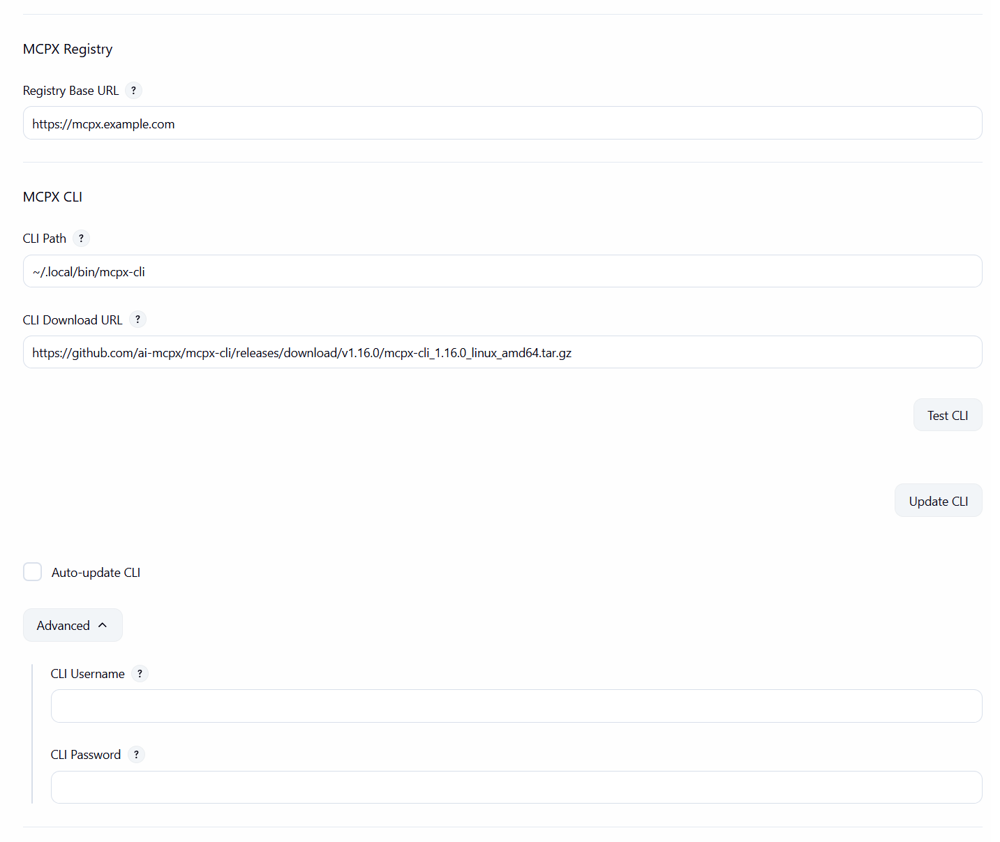
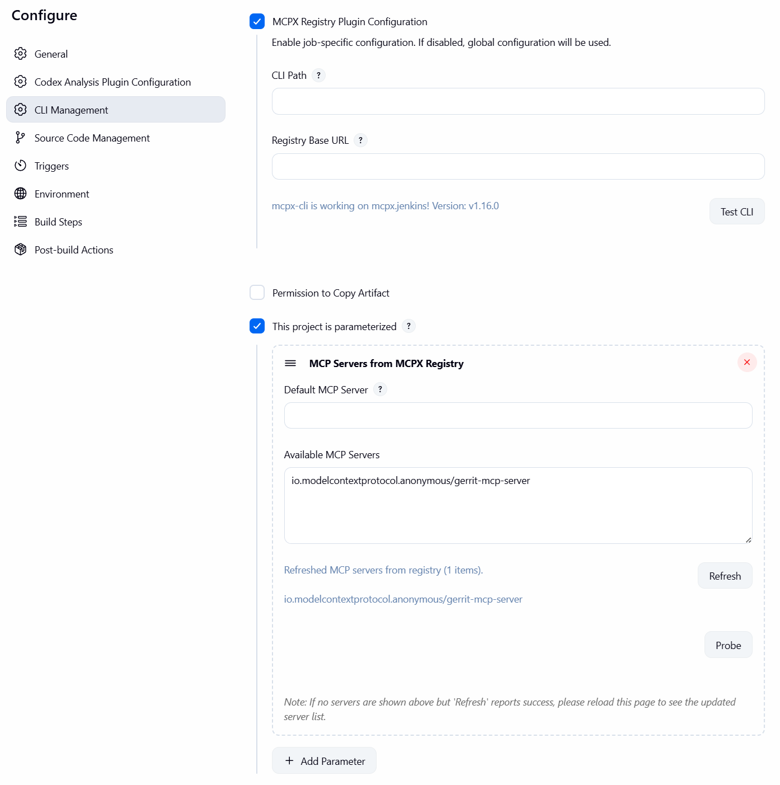

# MCPX Registry Jenkins Plugin

A Jenkins plugin that adds a build parameter to list MCP servers from an MCPX Registry and select one for your job.

## Table of Contents

- [Features](#features)
- [Quick Start](#quick-start)
- [MCPX CLI Integration](#mcpx-cli-integration)
  - [Login behavior](#login-behavior)
  - [Job-level overrides](#job-level-overrides)
  - [Why CLI instead of HTTP?](#why-cli-instead-of-http)
  - [Diagnostics: Probe](#diagnostics-probe)
- [Jenkinsfile example](#jenkinsfile-example)
- [Trigger via Jenkins API](#trigger-via-jenkins-api)
- [Development](#development)
- [License](#license)

## Features

- Global configuration for registry base URL
- Parameterized job input to select an MCP server from the registry
- Free-form parameter input with a read-only preview of available servers (full names only)
- Exposes selected values as environment variables: `$MCPX_SERVER_NAME` (from parameter), `$<PARAM_NAME>` (parameter name), and `$MCPX_SELECTED_SERVER` (from job-level selection)
- mcpx-cli integration: configure CLI path
- Job-level overrides: per-job CLI settings (path, registry URL)
- Diagnostics: one-click "Probe" button to test where mcpx-cli runs and preview raw JSON

## Quick Start

1) Build the plugin

```bash
mvn -U -e -ntp -DskipTests package
```

The resulting `.hpi` will be under `target/`.

2) Install in Jenkins
- Manage Jenkins → Plugins → Advanced → Upload Plugin → select the built `.hpi`.

3) Configure the registry
- Manage Jenkins → System → MCPX Registry: set the Registry Base URL

4) Configure mcpx-cli
- Manage Jenkins → System → MCPX CLI:
  - CLI Path: path to mcpx-cli (default: `~/.local/bin/mcpx-cli`)
  - Notes:
    - `~/` is supported and expands to the Jenkins process user’s home
    - If a job leaves its CLI Path empty, the global CLI Path is used by Test CLI
    - Ensure the configured path exists on the controller and/or any agents that will run refresh operations

Global (system) configuration example:



5) Add a parameter to a job (recommended)
- Configure job → This build is parameterized → Add parameter → “MCP Servers from MCPX Registry”
- The parameter provides a textbox for the server value and a read-only preview list showing entries as full identifiers.
- Click “Refresh” to fetch the latest servers from the registry. The plugin first tries the job’s labeled agent (Respect “Restrict where this project can be run”), then any online agent, and only as a last resort the controller.
- Click “Probe” to see exactly where mcpx-cli ran (controller or which agent), which base URL and CLI path were used, and a snippet of the raw JSON output. Use this to diagnose missing preview data.
- Paste or type the full server name into the textbox (e.g., `io.modelcontextprotocol.anonymous/gerrit-mcp-server`).

6) Use it in a build step

## MCPX CLI Integration

The plugin uses mcpx-cli to fetch server lists.

### Login behavior

Before listing servers, the plugin initializes the CLI session with an anonymous login, then lists servers:

```bash
mcpx-cli --base-url=<your-registry> login --method anonymous
mcpx-cli --base-url=<your-registry> servers --json
```

### Job-level overrides

Jobs can override global CLI settings:
1. Configure job → check "MCPX Registry Plugin Configuration"
2. Set any of:
  - CLI Path (e.g., a different version)
  - Registry Base URL (to use a different registry for this job)
  - Use the Test CLI button to verify the CLI works at the configured path

Job configuration example:



### Why CLI instead of HTTP?

- Avoids CORS: no browser restrictions
- Better auth handling: CLI manages tokens/config
- Consistent tooling: same as developer workflows
- Reliable behind proxies/firewalls

HTTP is intentionally not used to avoid CORS and environment-specific constraints. Install the CLI on Jenkins controller/agents.

### Diagnostics: Probe

The parameter UI provides a “Probe” button that executes mcpx-cli on the node selection the plugin uses (job’s labeled agent(s) → any online agent → controller) and returns a short message:

- Where it ran: “controller” or the agent’s node name
- Which base URL and CLI path were used
- A short snippet of the raw JSON from `mcpx-cli servers --json`

Typical use:
1) Click “Probe” to confirm mcpx-cli is installed at the path you configured on at least one candidate node
2) If Probe succeeds on an agent, click “Refresh” to update the available options
3) If Probe fails on all candidates, install mcpx-cli on the controller or configure your job to run on an agent that has mcpx-cli and set the job-level CLI Path accordingly

## Jenkinsfile example

```groovy
properties([
  parameters([
    [$class: 'io.modelcontextprotocol.jenkins.parameters.McpxServerParameterDefinition', name: 'MCP_SERVER', description: 'Select an MCP server', defaultServer: '']
  ])
])

pipeline {
  agent any
  stages {
    stage('Show selection') {
      steps {
        echo "Selected via parameter name: ${env.MCP_SERVER}"
        echo "Standardized param var: ${env.MCPX_SERVER_NAME}"
        echo "Job-level selection: ${env.MCPX_SELECTED_SERVER}"
      }
    }
  }
}
```

## Trigger via Jenkins API

You can start a build and pass the selected MCP server through the parameterized API. The default parameter name is `MCP_SERVER` unless you changed it when adding the parameter.

Notes:
- If CSRF protection is enabled, include a crumb in POST requests.
- For jobs inside folders, repeat `/job/<folder>` segments: `/job/<folder>/job/<job>/buildWithParameters`.
- URL-encode the server value if it contains `/` (e.g., replace `/` with `%2F`).

Using curl (Linux/macOS/WSL):

```bash
# 1) Get a crumb (may be optional depending on your Jenkins setup)
curl -s -u USER:API_TOKEN "http://<jenkins-host>:<port>/crumbIssuer/api/json" | jq -r .crumb

# 2) Trigger the build with parameters (replace <JOB_NAME> and <SERVER_VALUE>)
CRUMB=$(curl -s -u USER:API_TOKEN "http://<jenkins-host>:<port>/crumbIssuer/api/json" | jq -r .crumb)
curl -X POST \
  -u USER:API_TOKEN \
  -H "Jenkins-Crumb: $CRUMB" \
  -H "Content-Type: application/x-www-form-urlencoded" \
  --data-urlencode "MCP_SERVER=<SERVER_VALUE>" \
  "http://<jenkins-host>:<port>/job/<JOB_NAME>/buildWithParameters"
```

Using PowerShell (Windows):

```powershell
$base = "http://127.0.0.1:8081"
$job  = "mcpx.jenkins"   # or use folder path: job/Folder/job/MyJob
$user = "YOUR_USER"
$token = "YOUR_API_TOKEN"

# Basic auth header
$pair = "$user`:$token"
$b64  = [Convert]::ToBase64String([Text.Encoding]::ASCII.GetBytes($pair))
$auth = @{ Authorization = "Basic $b64" }

# 1) Get crumb (optional but recommended)
$crumbInfo = Invoke-RestMethod -Uri "$base/crumbIssuer/api/json" -Headers $auth -Method Get
$headers = $auth.Clone()
if ($crumbInfo.crumb) { $headers["Jenkins-Crumb"] = $crumbInfo.crumb }

# 2) Trigger build with parameter
$server = "io.modelcontextprotocol.anonymous%2Fgerrit-mcp-server"  # URL-encoded '/'
Invoke-RestMethod -Uri "$base/job/$job/buildWithParameters" -Method Post -Headers $headers -ContentType "application/x-www-form-urlencoded" -Body "MCP_SERVER=$server"
```

Tip: To discover your parameter name and available parameters, visit:
- `http://<jenkins-host>:<port>/job/<JOB_NAME>/api/json?tree=actions[parameterDefinitions[name,type,description]]`

## Helper script: `test/jenkins/mcpx.sh`

A convenience script is provided to quickly test the Jenkins job using curl. It:
- Verifies the configure page is reachable.
- Triggers a parameterized build, setting only the `MCP_SERVER` parameter.

Notes:
- The mcpx.jenkins plugin parses `mcpx.json` internally. This script does not parse it and only sends the `MCP_SERVER` value.
- CSRF crumb is fetched automatically when required.

Environment variables:
- `JENKINS_BASE` (default: `http://127.0.0.1:8081`)
- `JENKINS_JOB` (default: `mcpx.jenkins`)
- `JENKINS_USER` and `JENKINS_TOKEN` (optional; for authenticated Jenkins)
- `MCP_SERVER` (default: `io.modelcontextprotocol.anonymous/gerrit-mcp-server`)
- `MAX_TRIES` (default: `120`) — number of queue polls to wait for a build to start
- `SLEEP_SECS` (default: `2`) — seconds to sleep between queue polls
- `NO_FOLLOW` (default: `0`) — set to `1` to skip queue polling; only trigger the build and print the queue item URL
- `DEBUG` (default: `0`) — set to `1` to enable verbose tracing (equivalent to `set -x`) and extra diagnostics
- `CURL_CONNECT_TIMEOUT` (default: `5`) — seconds to wait for a TCP connection before giving up
- `CURL_MAX_TIME` (default: `15`) — maximum total seconds to allow each non-queue HTTP request
- `CRUMB_SKIP` (default: `1`) — set to `0` to attempt requesting a CSRF crumb (useful if your Jenkins requires it)
- `CRUMB_SILENT` (default: `1`) — suppress crumb request stderr (e.g., timeout messages); set to `0` to show
- `CURL_QUEUE_MAX_TIME` (default: `12`) — maximum total seconds for each queue API request (kept short to avoid long stalls)
- `QUEUE_TREE` (default: `executable[url],cancelled,why,stuck`) — fields to request from the queue API to reduce payload size
- `CONSOLE_TAIL` (default: `-1`) — ignored (script prints only the console URL)
- `QUEUE_SILENT` (default: `1`) — suppress curl error lines for queue calls (we print concise status lines instead)
- `BUILDS_SCAN_LIMIT` (default: `50`) — how many recent builds to scan to match by `queueId`
- `LASTBUILD_FASTPATH` (default: `1`) — also watch `lastBuild/buildNumber` during queue polling; if it increments, resolve immediately

Total wait time ≈ `MAX_TRIES * SLEEP_SECS` seconds.

Run from WSL/Linux:

```bash
JENKINS_BASE=http://127.0.0.1:8081 JENKINS_JOB=mcpx.jenkins JENKINS_USER=USER JENKINS_TOKEN=API_TOKEN MCP_SERVER="io.modelcontextprotocol.anonymous/gerrit-mcp-server" \
bash test/jenkins/mcpx.sh
```


Run from Windows PowerShell via WSL:

```powershell
wsl env JENKINS_BASE=http://127.0.0.1:8081 JENKINS_JOB=mcpx.jenkins JENKINS_USER=USER JENKINS_TOKEN=API_TOKEN MCP_SERVER="io.modelcontextprotocol.anonymous/gerrit-mcp-server" bash -lc './test/jenkins/mcpx.sh'
```

### Queue polling and timeouts

If your Jenkins queue is slow or intermittent, you can tune polling and timeouts:

- Increase total wait time while keeping each poll fast-failing:

```bash
CURL_QUEUE_MAX_TIME=8 MAX_TRIES=120 SLEEP_SECS=2 \
JENKINS_BASE=http://127.0.0.1:8081 JENKINS_JOB=mcpx.jenkins \
JENKINS_USER=USER JENKINS_TOKEN=API_TOKEN \
MCP_SERVER="io.modelcontextprotocol.anonymous/gerrit-mcp-server" \
bash test/jenkins/mcpx.sh
```

- Trigger without following the queue (just print queue URL):

```bash
NO_FOLLOW=1 \
JENKINS_BASE=http://127.0.0.1:8081 JENKINS_JOB=mcpx.jenkins \
JENKINS_USER=USER JENKINS_TOKEN=API_TOKEN \
MCP_SERVER="io.modelcontextprotocol.anonymous/gerrit-mcp-server" \
bash test/jenkins/mcpx.sh
```

- Skip CSRF crumb request if your instance doesn’t use it or it’s blocked:

```bash
CRUMB_SKIP=1 \
JENKINS_BASE=http://127.0.0.1:8081 JENKINS_JOB=mcpx.jenkins \
JENKINS_USER=USER JENKINS_TOKEN=API_TOKEN \
MCP_SERVER="io.modelcontextprotocol.anonymous/gerrit-mcp-server" \
bash test/jenkins/mcpx.sh
```

If you see `curl: (28) Operation timed out`:
- For the first crumb call, it’s often harmless — either set `CRUMB_SKIP=1` to bypass it, or `CRUMB_SILENT=0` to view details.
- For the queue poll, reduce `CURL_QUEUE_MAX_TIME` (e.g., 5–10s) so each poll doesn’t hang, and rely on `MAX_TRIES` × `SLEEP_SECS` for the overall wait budget.
- Set `NO_FOLLOW=1` to print only the queue URL if you don’t need to wait for the executable build.

Implementation note: the script uses HTTP/1.1 with `Connection: close` for queue polling to avoid long-lived connections on some Jenkins setups.

Console notes:
- The script prints the console URL only and does not fetch console output. Open the URL in a browser or curl it manually if needed.
  - Example: `curl -u USER:API_TOKEN "http://<jenkins>/job/<job>/<build>/consoleText"`
  - Or progressive: `curl -u USER:API_TOKEN "http://<jenkins>/job/<job>/<build>/logText/progressiveText?start=0" -D -`

Fallback logic:
- If the queue API keeps timing out, the script uses layered fallbacks to resolve the build:
  1) Try the Jenkins root queue (`/queue/api/json`) to locate your item by id and extract `executable.url` directly.
  2) Match `lastBuild.queueId` with your queue item id; if they match, immediately use that build’s URL.
  3) Scan recent builds (up to `BUILDS_SCAN_LIMIT`) and pick the first whose `queueId` equals your queue item id.
  4) If none of the above are available in time, revert to waiting for `lastBuild/buildNumber` to increment beyond the pre-trigger number.
  Notes:
  - In highly concurrent pipelines, any `lastBuild`-based heuristic can race; the queueId match is preferred and most precise.
  - Installing `jq` improves matching accuracy and performance for these fallbacks.

Verification endpoints (browse or curl):
- Job API index: `http://<jenkins>/job/<job>/api/`
- Recent builds with queueId: `http://<jenkins>/job/<job>/api/json?tree=builds[number,url,queueId]{,10}`
- Specific queue item: `http://<jenkins>/queue/item/<id>/api/json`

## Development

- Java 11+
- Jenkins 2.414.3+ baseline

Run tests:

```bash
mvn -ntp -Dspotbugs.skip package
```

## Troubleshooting

- Test CLI fails on job config page
    - Ensure the path is correct on the target node (controller or labeled agent)
    - Absolute paths are recommended (e.g., `/usr/local/bin/mcpx-cli`); `~/` works and is expanded
    - If the job field is empty, the global CLI Path is used

- No servers appear in the preview after clicking Refresh on the parameter
    - Ensure mcpx-cli is installed on the controller or at least one online agent at the configured path
    - The plugin prefers the job’s labeled agent; if none are online, it tries any online agent, and only then the controller
    - Confirm Registry Base URL is set in Manage Jenkins → System → MCPX Registry
    - Click “Probe” to see where it ran and what JSON the CLI returned; then check again
    - Check Jenkins logs for lines starting with “Failed to fetch via mcpx-cli” for details

- Probe failed: `Cannot run program "/var/jenkins_home/.local/bin/mcpx-cli": error=2`
  - mcpx-cli is not installed at that path on the controller. Options:
    - Install mcpx-cli on the controller at `/var/jenkins_home/.local/bin/mcpx-cli`, or update Global “CLI Path” to a valid controller path
    - Alternatively, configure your job with a label to run on an agent where mcpx-cli is installed and set the job-level “CLI Path” to the agent’s absolute path (e.g., `/home/jenkins/.local/bin/mcpx-cli`). The plugin prefers the job’s labeled agent for Refresh/Probe when available

## License

This project is licensed under the MIT License — see the [LICENSE](LICENSE) file for details.
