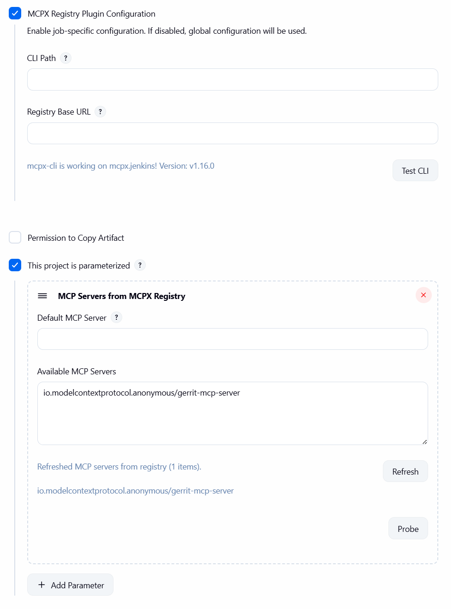

# MCPX Registry Jenkins Plugin

A Jenkins plugin that adds a build parameter to list MCP servers from an MCPX Registry and select one for your job.

## Table of Contents

- [Features](#features)
- [Quick Start](#quick-start)
- [MCPX CLI Integration](#mcpx-cli-integration)
  - [Login behavior](#login-behavior)
  - [Job-level overrides](#job-level-overrides)
  - [Why CLI instead of HTTP?](#why-cli-instead-of-http)
  - [Diagnostics: Probe](#diagnostics-probe)
- [Jenkinsfile example](#jenkinsfile-example)
- [Trigger via Jenkins API](#trigger-via-jenkins-api)
- [Testing script: `test/jenkins/jenkins.sh`](#testing-script-testjenkinsjenkinssh)
- [Development](#development)
- [License](#license)

## Features

- Global configuration for registry base URL
- Parameterized job input to select an MCP server from the registry
- Free-form parameter input with a read-only preview of available servers (full names only)
- Exposes selected values as environment variables: `$MCPX_SERVER_NAME` (from parameter), `$<PARAM_NAME>` (parameter name), and `$MCPX_SELECTED_SERVER` (from job-level selection)
- mcpx-cli integration: configure CLI path
- Job-level overrides: per-job CLI settings (path, registry URL) - works with both freestyle projects and pipeline jobs
- Diagnostics: one-click "Probe" button to test where mcpx-cli runs and preview raw JSON
- Full support for both freestyle projects and pipeline jobs

## Quick Start

1) Build the plugin

```bash
mvn -U -e -ntp -DskipTests package
```

The resulting `.hpi` will be under `target/`.

2) Install in Jenkins
- Manage Jenkins → Plugins → Advanced → Upload Plugin → select the built `.hpi`.

3) Configure the registry
- Manage Jenkins → System → MCPX Registry: set the Registry Base URL

4) Configure mcpx-cli
- Manage Jenkins → System → MCPX CLI:
  - CLI Path: path to mcpx-cli (default: `~/.local/bin/mcpx-cli`)
  - Notes:
    - `~/` is supported and expands to the Jenkins process user’s home
    - If a job leaves its CLI Path empty, the global CLI Path is used by Test CLI
    - Ensure the configured path exists on the controller and/or any agents that will run refresh operations

Global (system) configuration example:


5) Add a parameter to a job (recommended)
- Configure job → This build is parameterized → Add parameter → "MCP Servers from MCPX Registry"
- The parameter provides a textbox for the server value and a read-only preview list showing entries as full identifiers.
- Click "Refresh" to fetch the latest servers from the registry. The plugin first tries the job's labeled agent (for freestyle projects: "Restrict where this project can be run"; for pipeline jobs: labels are handled differently), then any online agent, and only as a last resort the controller.
- Click "Probe" to see exactly where mcpx-cli ran (controller or which agent), which base URL and CLI path were used, and a snippet of the raw JSON output. Use this to diagnose missing preview data.
- Paste or type the full server name into the textbox (e.g., `io.modelcontextprotocol.anonymous/gerrit-mcp-server`).

6) Use it in a build step

## MCPX CLI Integration

The plugin uses mcpx-cli to fetch server lists.

### Login behavior

Before listing servers, the plugin initializes the CLI session with an anonymous login, then lists servers:

```bash
mcpx-cli --base-url=<your-registry> login --method anonymous
mcpx-cli --base-url=<your-registry> servers --json
```

### Job-level overrides

Both freestyle projects and pipeline jobs can override global CLI settings:
1. Configure job → check "MCPX Registry Plugin Configuration"
2. Set any of:
  - CLI Path (e.g., a different version)
  - Registry Base URL (to use a different registry for this job)
  - Use the Test CLI button to verify the CLI works at the configured path

Job configuration example:



### Why CLI instead of HTTP?

- Avoids CORS: no browser restrictions
- Better auth handling: CLI manages tokens/config
- Consistent tooling: same as developer workflows
- Reliable behind proxies/firewalls

HTTP is intentionally not used to avoid CORS and environment-specific constraints. Install the CLI on Jenkins controller/agents.

### Diagnostics: Probe

The parameter UI provides a "Probe" button that executes mcpx-cli on the node selection the plugin uses (job's labeled agent(s) for freestyle projects → any online agent → controller) and returns a short message:

- Where it ran: "controller" or the agent's node name
- Which base URL and CLI path were used
- A short snippet of the raw JSON from `mcpx-cli servers --json`

**Note:** For freestyle projects, the plugin respects the job's assigned label ("Restrict where this project can be run"). For pipeline jobs, label restrictions are handled differently by Jenkins, so the plugin will try any online agent before falling back to the controller.

Typical use:
1) Click "Probe" to confirm mcpx-cli is installed at the path you configured on at least one candidate node
2) If Probe succeeds on an agent, click "Refresh" to update the available options
3) If Probe fails on all candidates, install mcpx-cli on the controller or configure your job to run on an agent that has mcpx-cli and set the job-level CLI Path accordingly

## Jenkinsfile example

```groovy
properties([
  parameters([
    [$class: 'io.modelcontextprotocol.jenkins.parameters.McpxServerParameterDefinition', name: 'MCP_SERVER', description: 'Select an MCP server', defaultServer: '']
  ])
])

pipeline {
  agent any
  stages {
    stage('Show selection') {
      steps {
        echo "Selected via parameter name: ${env.MCP_SERVER}"
        echo "Standardized param var: ${env.MCPX_SERVER_NAME}"
        echo "Job-level selection: ${env.MCPX_SELECTED_SERVER}"
      }
    }
  }
}
```

## Trigger via Jenkins API

You can start a build and pass the selected MCP server through the parameterized API. The default parameter name is `MCP_SERVER` unless you changed it when adding the parameter.

Notes:
- If CSRF protection is enabled, include a crumb in POST requests.
- For jobs inside folders, repeat `/job/<folder>` segments: `/job/<folder>/job/<job>/buildWithParameters`.
- URL-encode the server value if it contains `/` (e.g., replace `/` with `%2F`).

### Enable "Trigger builds remotely" (job configuration)

To trigger a job from scripts, configure a remote trigger token on the job:

1) Open your job → Configure
2) Under "Build Triggers", check "Trigger builds remotely (e.g., from scripts)"
3) Enter a Token value, for example: `mcpx.jenkins`
4) Save

How it is used:
- When enabled, Jenkins accepts requests to `.../job/<job>/buildWithParameters` with an extra `token=<YOUR_TOKEN>` parameter.

Security and CSRF notes:
- On many Jenkins instances, a GET with `token=<...>` is sufficient and returns a 201 with a `Location` header pointing at the queue item.
- Some instances (security configs, reverse proxies) may require POST. If CSRF is enabled, a crumb may also be needed.
- If your Jenkins denies anonymous access, you must include Basic auth even when using a token.

## Testing script: `test/jenkins/jenkins.sh`

A simple testing script for triggering Jenkins jobs on Ubuntu using curl. This script demonstrates the basic workflow of triggering a parameterized build, polling the queue, fetching build results, and dumping the full console output after the job finishes.

### Configuration

Edit the script to set your Jenkins configuration:

```bash
BASE_URL='http://<jenkins-host>:<port>'
AUTH='USER:API_TOKEN'
JOB_NAME='mcpx.jenkins'
# Set to 'true' to enable DEBUG output, 'false' to disable
DEBUG_ENABLED='true'
```

- `BASE_URL`: Your Jenkins server URL
- `AUTH`: Basic auth credentials in the format `USER:API_TOKEN`
- `JOB_NAME`: The name of the Jenkins job to trigger
- `DEBUG_ENABLED`: Set to `'true'` to enable verbose DEBUG output (default), or `'false'` to suppress all DEBUG messages for cleaner output

### Usage

```bash
# Make the script executable
chmod +x test/jenkins/jenkins.sh

# Run the script
./test/jenkins/jenkins.sh
```

### Output

The script outputs a single merged JSON object containing both build metadata and console output:

- **Build metadata**: `number`, `result`, `builtOn`, `fullDisplayName`, `timestamp`, `duration`, `queueId`
- **Console output**: `consoleOutput` - full console log (only if the job has finished, otherwise empty string)

The console output is automatically fetched and merged after the job completes. No streaming is performed; the entire console log is retrieved once the build finishes and merged into the JSON output for easy parsing.

Example output format:
```json
{
  "number": 39,
  "result": "SUCCESS",
  "builtOn": "mcpx.jenkins",
  "fullDisplayName": "mcpx.jenkins #39",
  "timestamp": 1762416127226,
  "duration": 34,
  "queueId": 38,
  "consoleOutput": "Started by remote host...\nRunning as SYSTEM\n..."
}
```

Note: If the job is still building or console output cannot be fetched, `consoleOutput` will be an empty string. DEBUG messages (if enabled) are sent to stderr, while the JSON output is sent to stdout.

### Prerequisites

- `curl` installed
- `jq` installed (`sudo apt-get install jq` on Ubuntu)
- Jenkins job configured with "Trigger builds remotely" enabled and a token set
- Basic auth credentials (USER:API_TOKEN)

## Development

- Java 11+
- Jenkins 2.414.3+ baseline

Run tests:

```bash
mvn -ntp -Dspotbugs.skip package
```

## Troubleshooting

- Test CLI fails on job config page
    - Ensure the path is correct on the target node (controller or labeled agent)
    - Absolute paths are recommended (e.g., `/usr/local/bin/mcpx-cli`); `~/` works and is expanded
    - If the job field is empty, the global CLI Path is used
    - Works for both freestyle projects and pipeline jobs

- No servers appear in the preview after clicking Refresh on the parameter
    - Ensure mcpx-cli is installed on the controller or at least one online agent at the configured path
    - For freestyle projects: The plugin prefers the job's labeled agent; if none are online, it tries any online agent, and only then the controller
    - For pipeline jobs: The plugin tries any online agent, then falls back to the controller (label restrictions are handled differently by Jenkins)
    - Confirm Registry Base URL is set in Manage Jenkins → System → MCPX Registry
    - Click "Probe" to see where it ran and what JSON the CLI returned; then check again
    - Check Jenkins logs for lines starting with "Failed to fetch via mcpx-cli" for details

- Probe failed: `Cannot run program "/var/jenkins_home/.local/bin/mcpx-cli": error=2`
  - mcpx-cli is not installed at that path on the controller. Options:
    - Install mcpx-cli on the controller at `/var/jenkins_home/.local/bin/mcpx-cli`, or update Global "CLI Path" to a valid controller path
    - Alternatively, configure your job with a label to run on an agent where mcpx-cli is installed and set the job-level "CLI Path" to the agent's absolute path (e.g., `/home/jenkins/.local/bin/mcpx-cli`). For freestyle projects, the plugin prefers the job's labeled agent for Refresh/Probe when available

## License

This project is licensed under the MIT License — see the [LICENSE](LICENSE) file for details.
