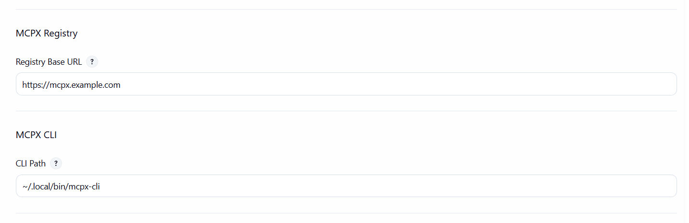

# MCPX Registry Jenkins Plugin

A Jenkins plugin that adds a build parameter to list MCP servers from an MCPX Registry and select one for your job.

## Table of Contents

- [Features](#features)
- [Quick Start](#quick-start)
- [MCPX CLI Integration](#mcpx-cli-integration)
  - [Login behavior](#login-behavior)
  - [Job-level overrides](#job-level-overrides)
  - [Why CLI instead of HTTP?](#why-cli-instead-of-http)
  - [Diagnostics: Probe](#diagnostics-probe)
- [Jenkinsfile example](#jenkinsfile-example)
  - [Running MCP Servers in Pipeline](#running-mcp-servers-in-pipeline)
- [Trigger via Jenkins API](#trigger-via-jenkins-api)
- [Testing script: `test/jenkins/jenkins.sh`](#testing-script-testjenkinsjenkinssh)
- [Development](#development)
- [License](#license)

## Features

- Global configuration for registry base URL
- Parameterized job input to select an MCP server from the registry
- Text input parameter with default value support from job configuration
- Exposes selected value as environment variable: `$MCP_SERVER` (or your custom parameter name)
- Default value from job configuration: Set "Default MCP Server" in parameter configuration to pre-fill the value
- Automatic parameter extraction from packages: When `MCP_SERVER` is set, parameters from the server's `packages` configuration (runtimeArguments and environmentVariables) are automatically extracted and set as environment variables with default values
- Run MCP servers in pipelines: Execute MCP servers on labeled agents with automatic command construction based on registry type (docker, binary, npm, pypi, wheel)
- mcpx-cli integration: configure CLI path
- Job-level overrides: per-job CLI settings (path, registry URL) - works with both freestyle projects and pipeline jobs
- Diagnostics: one-click "Probe" button to test where mcpx-cli runs and preview raw JSON
- Full support for both freestyle projects and pipeline jobs
- Full support for parameters defined in Jenkinsfiles using `properties([parameters([...])])`

## Quick Start

1) Build the plugin

```bash
mvn -U -e -ntp -DskipTests package
```

The resulting `.hpi` will be under `target/`.

2) Install in Jenkins
- Manage Jenkins → Plugins → Advanced → Upload Plugin → select the built `.hpi`.

3) Configure the registry
- Manage Jenkins → System → MCPX Registry: set the Registry Base URL

4) Configure mcpx-cli
- Manage Jenkins → System → MCPX CLI:
  - CLI Path: absolute path to mcpx-cli (e.g., `/home/jenkins/.local/bin/mcpx-cli` or `/usr/local/bin/mcpx-cli`)
  - Notes:
    - Use absolute paths (e.g., `/home/jenkins/.local/bin/mcpx-cli`) instead of paths with `~` (e.g., `~/.local/bin/mcpx-cli`)
    - If a job leaves its CLI Path empty, the global CLI Path is used by Test CLI
    - Ensure the configured path exists on the controller and/or any agents that will run refresh operations

Global (system) configuration example:



5) Add a parameter to a job (recommended)
- Configure job → This build is parameterized → Add parameter → "MCP Servers from MCPX Registry"
- Set "Default MCP Server" (optional): Enter a default server value that will be pre-filled in "Build with Parameters"
- The parameter configuration page shows:
  - "Default MCP Server": The default value to use when building
  - "Available MCP Servers": A read-only preview of servers from the registry
  - "Refresh" button: Fetches the latest servers from the registry
  - "Probe" button: Tests where mcpx-cli runs and shows raw JSON output
- In "Build with Parameters", the text field will be pre-filled with the default value from configuration
- If left empty, the default value from configuration will be used
- Paste or type the full server name into the textbox (e.g., `io.modelcontextprotocol.anonymous/gerrit-mcp-server`)

6) Use it in a build step

## Package Parameters

When `MCP_SERVER` is configured (either in job configuration or via "Build with Parameters"), the plugin automatically:

1. Queries the server details using mcpx-cli to fetch the `packages` configuration
2. Extracts parameters from the first package's `registryType`, `runtimeArguments`, and `environmentVariables`
3. Sets them as environment variables with default values from the package definition

### Parameter Naming

Parameters are automatically named based on their type:

- **Package metadata**: `MCPX_REGISTRY_TYPE` (from `registryType` in the package, e.g., `docker`, `binary`, `npm`, `pypi`, `wheel`)
- **Named runtime arguments**:
  - If `valueHint` is present: `MCPX_<VALUE_HINT>` (e.g., `-p` with `valueHint: "port_mapping"` → `MCPX_PORT_MAPPING`)
  - Otherwise: `MCPX_<ARG_NAME>` (e.g., `--port` → `MCPX_PORT`, `--host` → `MCPX_HOST`)
- **Positional runtime arguments**: `MCPX_<VALUE_HINT>` (e.g., `port_mapping` → `MCPX_PORT_MAPPING`)
- **Environment variables**: `MCPX_<VAR_NAME>` (e.g., `GERRIT_BASE_URL` → `MCPX_GERRIT_BASE_URL`)

### Default Values

Default values are automatically extracted from the package definition:
- If a parameter has a `default` value in the package, it will be set as the environment variable's default
- User-provided parameter values (from "Build with Parameters") take precedence over defaults
- If a parameter is not provided by the user and has a default in the package, the default value is used

### Usage in Builds

Package parameters are automatically available as environment variables in your build steps:

```groovy
pipeline {
  agent any
  stages {
    stage('Use package parameters') {
      steps {
        echo "MCP Server: ${env.MCP_SERVER}"
        echo "Registry Type: ${env.MCPX_REGISTRY_TYPE}"
        echo "Port: ${env.MCPX_PORT}"
        echo "Host: ${env.MCPX_HOST}"
        echo "Gerrit URL: ${env.MCPX_GERRIT_BASE_URL}"
      }
    }
  }
}
```

### Example: Package Configuration

#### Example 1: Named Arguments with valueHint

```json
{
  "packages": [
    {
      "registryType": "docker",
      "runtimeArguments": [
        {
          "type": "named",
          "name": "-p",
          "valueHint": "port_mapping",
          "default": "8004:8000",
          "description": "Port mapping for the container"
        },
        {
          "type": "named",
          "name": "--port",
          "default": "8005",
          "description": "Server port number"
        }
      ]
    }
  ]
}
```

When `MCP_SERVER` is set to this server:
- `MCPX_REGISTRY_TYPE`: `docker` (from `registryType` in the package)
- `MCPX_PORT_MAPPING`: `8004:8000` (uses `valueHint` from `-p` argument)
- `MCPX_PORT`: `8005` (uses `name` from `--port` argument)

#### Example 2: Mixed Arguments and Environment Variables

```json
{
  "packages": [
    {
      "registryType": "docker",
      "runtimeArguments": [
        {
          "type": "named",
          "name": "--port",
          "default": "8005",
          "description": "Server port number"
        },
        {
          "type": "positional",
          "valueHint": "port_mapping",
          "default": "6322:6322",
          "description": "Port mapping for the container"
        }
      ],
      "environmentVariables": [
        {
          "name": "GERRIT_BASE_URL",
          "default": "https://gerrit-review.googlesource.com/",
          "description": "Default Gerrit server URL"
        },
        {
          "name": "MCP_LOG_LEVEL",
          "default": "INFO",
          "description": "Logging level"
        }
      ]
    }
  ]
}
```

When `MCP_SERVER` is set to this server, the following environment variables will be available:

- `MCP_SERVER`: The selected server name
- `MCPX_REGISTRY_TYPE`: `docker` (from `registryType` in the package)
- `MCPX_PORT`: `8005` (default from `--port`)
- `MCPX_PORT_MAPPING`: `6322:6322` (default from positional argument)
- `MCPX_GERRIT_BASE_URL`: `https://gerrit-review.googlesource.com/` (default from environment variable)
- `MCPX_MCP_LOG_LEVEL`: `INFO` (default from environment variable)

### Adding Parameters to Job Configuration

To use package parameters in "Build with Parameters", you can add them as String parameters in your job configuration:

1. Configure job → This build is parameterized → Add parameter → String Parameter
2. Name the parameter using the naming convention:
   - `MCPX_REGISTRY_TYPE` - Registry type from the package (e.g., `docker`, `binary`, `npm`, `pypi`, `wheel`)
   - `MCPX_PORT`, `MCPX_HOST`, etc. - Runtime arguments from the package
   - `MCPX_GERRIT_BASE_URL`, `MCPX_MCP_LOG_LEVEL`, etc. - Environment variables from the package
3. Leave the default value empty - it will be automatically set from the package when `MCP_SERVER` is configured

Alternatively, you can query available parameters for a server:
- In the parameter configuration page, use the "Get Package Parameters" action (if available) to see what parameters are defined in the server's packages
- Add those parameters as String parameters in your job configuration

**Note**: Package parameters are automatically injected as environment variables even if they're not explicitly defined as job parameters. However, adding them as job parameters allows users to override the defaults in "Build with Parameters".

## MCPX CLI Integration

The plugin uses mcpx-cli to fetch server lists.

### Login behavior

Before listing servers, the plugin initializes the CLI session with an anonymous login, then lists servers:

```bash
mcpx-cli --base-url=<your-registry> login --method anonymous
mcpx-cli --base-url=<your-registry> servers --json
```

### Job-level overrides

Both freestyle projects and pipeline jobs can override global CLI settings. **Job-level configuration takes precedence over global configuration.**

1. Configure job → check "MCPX Registry Plugin Configuration"
2. Set any of:
  - CLI Path (e.g., a different version or path on a specific agent) - **overrides global CLI Path**
  - Registry Base URL (to use a different registry for this job) - **overrides global Registry Base URL**
  - Use the Test CLI button to verify the CLI works at the configured path

**Configuration Priority:**
- Job-level settings override global settings
- If job-level setting is empty or not configured, global setting is used
- If both are empty, defaults are used (e.g., `mcpx-cli` for CLI Path)

Job configuration example:


### Why CLI instead of HTTP?

- Avoids CORS: no browser restrictions
- Better auth handling: CLI manages tokens/config
- Consistent tooling: same as developer workflows
- Reliable behind proxies/firewalls

HTTP is intentionally not used to avoid CORS and environment-specific constraints. Install the CLI on Jenkins controller/agents.

### Diagnostics: Probe

The parameter configuration page provides "Refresh" and "Probe" buttons:

- **Refresh**: Fetches the latest servers from the registry and updates the "Available MCP Servers" preview
- **Probe**: Executes mcpx-cli on the node selection the plugin uses (job's labeled agent(s) for freestyle projects → any online agent → controller) and returns a short message:
  - Where it ran: "controller" or the agent's node name
  - Which base URL and CLI path were used
  - A short snippet of the raw JSON from `mcpx-cli servers --json`

**Note:** For freestyle projects, the plugin respects the job's assigned label ("Restrict where this project can be run"). For pipeline jobs, label restrictions are handled differently by Jenkins, so the plugin will try any online agent before falling back to the controller.

Typical use:
1) Click "Probe" in the parameter configuration to confirm mcpx-cli is installed at the path you configured on at least one candidate node
2) If Probe succeeds on an agent, click "Refresh" to update the available options preview
3) If Probe fails on all candidates, install mcpx-cli on the controller or configure your job to run on an agent that has mcpx-cli and set the job-level CLI Path accordingly

## Jenkinsfile example

### Basic example

```groovy
properties([
  parameters([
    [$class: 'io.modelcontextprotocol.jenkins.parameters.McpxServerParameterDefinition', name: 'MCP_SERVER', description: 'Select an MCP server', defaultServer: '']
  ])
])

pipeline {
  agent any
  stages {
    stage('Show selection') {
      steps {
        echo "Selected MCP server: ${env.MCP_SERVER}"
      }
    }
  }
}
```

**Note:** The `defaultServer` parameter in the Jenkinsfile sets the default value. You can also set it in the job configuration UI under "Default MCP Server". If the user leaves the field empty in "Build with Parameters", the configured default value will be used.

### Example with Package Parameters

The test file `test/jenkins/jenkins.file` demonstrates how to use package parameters that are automatically extracted from the MCP server's packages configuration:

```groovy
properties([
  parameters([
    [$class: 'io.modelcontextprotocol.jenkins.parameters.McpxServerParameterDefinition', name: 'MCP_SERVER', description: 'Select an MCP server', defaultServer: '']
    // Package parameters are automatically available as environment variables when MCP_SERVER is set
  ])
])

pipeline {
  agent {
    label 'mcpx.jenkins'
  }
  stages {
    stage('Show Package Parameters') {
      steps {
        script {
          echo "MCP_SERVER: ${env.MCP_SERVER ?: 'Not set'}"

          // Package metadata
          if (env.MCPX_REGISTRY_TYPE) {
            echo "MCPX_REGISTRY_TYPE: ${env.MCPX_REGISTRY_TYPE}"
          }

          // Package parameters are automatically available
          if (env.MCPX_PORT) {
            echo "MCPX_PORT: ${env.MCPX_PORT}"
          }
          if (env.MCPX_PORT_MAPPING) {
            echo "MCPX_PORT_MAPPING: ${env.MCPX_PORT_MAPPING}"
          }
          if (env.MCPX_MCP_LOG_LEVEL) {
            echo "MCPX_MCP_LOG_LEVEL: ${env.MCPX_MCP_LOG_LEVEL}"
          }

          // Show all MCPX_* environment variables
          sh 'env | grep "^MCPX_" | sort || echo "No MCPX_* environment variables found"'
        }
      }
    }
  }
}
```

When `MCP_SERVER` is set, package parameters are automatically injected as environment variables with their default values from the server's packages configuration. You can access them directly in your pipeline steps.

### Running MCP Servers in Pipeline

The test file `test/jenkins/jenkins.file` includes a "Run MCP Server" stage that executes MCP servers based on the selected server and its package configuration. This stage:

1. Retrieves CLI path and base URL from Jenkins plugin configuration with the following priority:

   **CLI Path Priority:**
   - **MCPX_CLI_PATH environment variable** (works even if script security blocks configuration access)
   - **Job-level configuration** (overrides global, but may be blocked by script security sandbox)
   - **Global configuration** (used if job-level is not set, but may be blocked by script security sandbox)
   - **Default value**: `mcpx-cli` (fallback if neither is configured)

   **Registry Base URL Priority:**
   - **Job-level configuration** (overrides global, but may be blocked by script security sandbox)
   - **Global configuration** (used if job-level is not set, but may be blocked by script security sandbox)
   - **MCPX_REGISTRY_BASE_URL environment variable** (works even if script security blocks configuration access)
   - **Default value**: `https://registry.modelcontextprotocol.io` (fallback if none are configured)

   **Note**: If script security sandbox blocks access to configuration (you'll see warnings about `getRawBuild` and `McpxGlobalConfiguration.get`), you can either:
   - **Recommended workaround**: Set environment variables in the job configuration:
     - `MCPX_CLI_PATH` = `/path/to/mcpx-cli` (absolute path)
     - `MCPX_REGISTRY_BASE_URL` = `https://your-registry-url.com` (your configured registry base URL)
   - **Alternative**: Approve the script signatures in Manage Jenkins → In-process Script Approval:
     - `method org.jenkinsci.plugins.workflow.support.steps.build.RunWrapper getRawBuild`
     - `staticMethod io.modelcontextprotocol.jenkins.McpxGlobalConfiguration get`

2. Fetches server details using `mcpx-cli` to extract package information (identifier, version, runtime arguments, environment variables)
3. Constructs the appropriate command based on the registry type (`MCPX_REGISTRY_TYPE`)
4. Maps `MCPX_*` environment variables to actual environment variables and runtime arguments
5. Executes the server on the labeled agent

**Supported Registry Types:**

- **Docker**: Constructs `docker run` commands with appropriate flags (`-p`, `-v`, `--network`, `-e`), environment variables, and arguments
- **Binary**: Executes the binary directly with runtime arguments
- **npm**: Uses `npx` to run npm packages
- **pypi/wheel**: Uses Python to run Python packages

**Example: Running MCP Server Stage**

```groovy
properties([
  parameters([
    [$class: 'io.modelcontextprotocol.jenkins.parameters.McpxServerParameterDefinition', name: 'MCP_SERVER', description: 'Select an MCP server', defaultServer: '']
  ])
])

// Helper functions to get configuration (using @NonCPS to bypass sandbox)
// Must be defined at top level, not inside script block
@NonCPS
def getJobCliPath() {
  try {
    def job = currentBuild.rawBuild.project
    def jobProperty = job.getProperty(io.modelcontextprotocol.jenkins.McpxJobProperty.class)
    if (jobProperty != null) {
      def path = jobProperty.getCliPath()
      return (path != null && path.trim() != '') ? path.trim() : null
    }
    return null
  } catch (Exception e) {
    return null
  }
}

@NonCPS
def getGlobalCliPath() {
  try {
    def globalConfig = io.modelcontextprotocol.jenkins.McpxGlobalConfiguration.get()
    if (globalConfig != null) {
      def path = globalConfig.getCliPath()
      return (path != null && path.trim() != '') ? path.trim() : null
    }
    return null
  } catch (Exception e) {
    return null
  }
}

@NonCPS
def getJobRegistryBaseUrl() {
  try {
    def job = currentBuild.rawBuild.project
    def jobProperty = job.getProperty(io.modelcontextprotocol.jenkins.McpxJobProperty.class)
    if (jobProperty != null) {
      def url = jobProperty.getRegistryBaseUrl()
      return (url != null && url.trim() != '') ? url.trim() : null
    }
    return null
  } catch (Exception e) {
    return null
  }
}

@NonCPS
def getGlobalRegistryBaseUrl() {
  try {
    def globalConfig = io.modelcontextprotocol.jenkins.McpxGlobalConfiguration.get()
    if (globalConfig != null) {
      def url = globalConfig.getRegistryBaseUrl()
      return (url != null && url.trim() != '') ? url.trim() : null
    }
    return null
  } catch (org.jenkinsci.plugins.scriptsecurity.sandbox.RejectedAccessException e) {
    // Script security sandbox is blocking access to global configuration
    return null
  } catch (java.lang.SecurityException e) {
    // Security exception when accessing global configuration
    return null
  } catch (Exception e) {
    // Any other exception
    return null
  }
}

pipeline {
  agent {
    label 'mcpx.jenkins'  // Run on labeled agent
  }
  stages {
    stage('Show MCP Server') {
      steps {
        echo "Selected MCP server: ${env.MCP_SERVER}"
      }
    }
    stage('Run MCP Server') {
      when {
        expression { env.MCP_SERVER != null && env.MCP_SERVER != '' }
      }
      steps {
        script {
          def registryType = env.MCPX_REGISTRY_TYPE ?: 'unknown'
          echo "Running MCP server: ${env.MCP_SERVER}"
          echo "Registry type: ${registryType}"

          // Get CLI path and base URL from Jenkins plugin configuration
          // Use @NonCPS helper functions to get values directly (bypasses sandbox)
          def jobCliPath = getJobCliPath()
          def globalCliPath = getGlobalCliPath()

          // Get CLI path (job-level overrides global, then default)
          def mcpxCliPath = null
          if (jobCliPath != null) {
            mcpxCliPath = jobCliPath  // Job-level overrides global
          } else if (globalCliPath != null) {
            mcpxCliPath = globalCliPath  // Use global if job-level not set
          } else {
            mcpxCliPath = 'mcpx-cli'  // Default fallback
          }

          // Get base URL from job-level or global configuration
          // Priority: job-level > global > environment variable > default
          def jobBaseUrl = getJobRegistryBaseUrl()
          def globalBaseUrl = getGlobalRegistryBaseUrl()

          def baseUrl = null
          if (jobBaseUrl != null) {
            baseUrl = jobBaseUrl
            echo "Using job-level registry base URL: ${baseUrl}"
          } else if (globalBaseUrl != null) {
            baseUrl = globalBaseUrl
            echo "Using global registry base URL: ${baseUrl}"
          } else if (env.MCPX_REGISTRY_BASE_URL != null && env.MCPX_REGISTRY_BASE_URL.trim() != '') {
            baseUrl = env.MCPX_REGISTRY_BASE_URL.trim()
            echo "Using registry base URL from MCPX_REGISTRY_BASE_URL environment variable: ${baseUrl}"
          } else {
            baseUrl = 'https://registry.modelcontextprotocol.io'
            echo "WARNING: Using default registry base URL: ${baseUrl}"
            echo "Note: Global configuration access may be blocked by script security sandbox."
            echo "      To use your configured 'Registry Base URL' from Global Configuration, either:"
            echo "      1. Set MCPX_REGISTRY_BASE_URL environment variable in job configuration"
            echo "      2. Approve script security for McpxGlobalConfiguration.get in Manage Jenkins → In-process Script Approval"
          }

          // Fetch server details to get package information
          def serverJson = sh(
            script: "${mcpxCliPath} --base-url=${baseUrl} server ${env.MCP_SERVER} --json",
            returnStdout: true
          ).trim()

          def serverData = readJSON text: serverJson
          def packageInfo = serverData.packages?.find { pkg ->
            pkg.registryType == registryType
          } ?: serverData.packages?.get(0)

          // Build and execute command based on registry type
          // (See test/jenkins/jenkins.file for complete implementation)
        }
      }
    }
  }
}
```

For a complete implementation example, see `test/jenkins/jenkins.file` which includes the full logic for handling all registry types and configuration retrieval.

### Using labeled agents in pipeline jobs

To run your pipeline job on a specific labeled agent (similar to "Restrict where this project can be run" in freestyle jobs), use the `agent` directive with a label:

```groovy
properties([
  parameters([
    [$class: 'io.modelcontextprotocol.jenkins.parameters.McpxServerParameterDefinition', name: 'MCP_SERVER', description: 'Select an MCP server', defaultServer: '']
  ])
])

pipeline {
  agent {
    label 'your-agent-label'
  }
  stages {
    stage('Show selection') {
      steps {
        echo "Selected MCP server: ${env.MCP_SERVER}"
      }
    }
  }
}
```

**Note:** When you use a labeled agent in your pipeline job:
- The pipeline will run on an agent matching that label
- The "Test CLI" button in job configuration will use the controller with the global CLI Path configuration (as pipeline jobs don't expose labels during configuration time)

**Assigning labels to agents:**
1. Navigate to **Manage Jenkins** > **Manage Nodes and Clouds**
2. Click on the agent you wish to label
3. Click **Configure**
4. In the **Labels** field, enter the desired labels separated by spaces
5. Click **Save**

## Trigger via Jenkins API

You can start a build and pass the selected MCP server through the parameterized API. The default parameter name is `MCP_SERVER` unless you changed it when adding the parameter.

### Passing Package Parameters

When triggering a build via API, you can optionally pass package parameters to override the defaults from the server's packages configuration:

```bash
# Basic trigger with MCP_SERVER only
curl "${BASE_URL}/job/${JOB_NAME}/buildWithParameters?MCP_SERVER=io.modelcontextprotocol.anonymous%2Fgerrit-mcp-server&token=YOUR_TOKEN"

# Trigger with MCP_SERVER and package parameter overrides
curl "${BASE_URL}/job/${JOB_NAME}/buildWithParameters?MCP_SERVER=io.modelcontextprotocol.anonymous%2Fgerrit-mcp-server&MCPX_REGISTRY_TYPE=binary&MCPX_PORT=9000&MCPX_MCP_LOG_LEVEL=DEBUG&token=YOUR_TOKEN"
```

**Note:** Package parameters are automatically set from the server's packages when `MCP_SERVER` is provided. Passing them explicitly will override the defaults.

Notes:
- If CSRF protection is enabled, include a crumb in POST requests.
- For jobs inside folders, repeat `/job/<folder>` segments: `/job/<folder>/job/<job>/buildWithParameters`.
- URL-encode the server value if it contains `/` (e.g., replace `/` with `%2F`).
- URL-encode package parameter values appropriately (spaces as `%20`, special characters as needed).

### Enable "Trigger builds remotely" (job configuration)

To trigger a job from scripts, configure a remote trigger token on the job:

1) Open your job → Configure
2) Under "Build Triggers", check "Trigger builds remotely (e.g., from scripts)"
3) Enter a Token value, for example: `mcpx.jenkins`
4) Save

How it is used:
- When enabled, Jenkins accepts requests to `.../job/<job>/buildWithParameters` with an extra `token=<YOUR_TOKEN>` parameter.

Security and CSRF notes:
- On many Jenkins instances, a GET with `token=<...>` is sufficient and returns a 201 with a `Location` header pointing at the queue item.
- Some instances (security configs, reverse proxies) may require POST. If CSRF is enabled, a crumb may also be needed.
- If your Jenkins denies anonymous access, you must include Basic auth even when using a token.

## Testing script: `test/jenkins/jenkins.sh`

A simple testing script for triggering Jenkins jobs on Ubuntu using curl. This script demonstrates the basic workflow of triggering a parameterized build, polling the queue, fetching build results, and dumping the full console output after the job finishes.

The script supports testing package parameters by allowing you to optionally override defaults from the server's packages configuration.

### Configuration

Edit the script to set your Jenkins configuration:

```bash
BASE_URL='http://<jenkins-host>:<port>'
AUTH='USER:API_TOKEN'
JOB_NAME='mcpx.jenkins'
MCP_SERVER='io.modelcontextprotocol.anonymous/gerrit-mcp-server'

# Package parameters (optional - these will override defaults from packages)
# Uncomment and set values to test parameter overrides:
# MCPX_PORT='8005'                    # Named runtime argument: --port
# MCPX_HOST='0.0.0.0'                # Named runtime argument: --host
# MCPX_PORT_MAPPING='8004:8000'      # Named runtime argument with valueHint: -p -> port_mapping
# MCPX_MCP_LOG_LEVEL='DEBUG'         # Environment variable: MCP_LOG_LEVEL
# MCPX_MCP_DATA_DIR='/custom/data'   # Environment variable: MCP_DATA_DIR
# MCPX_GERRIT_BASE_URL='https://custom-gerrit.example.com/'  # Environment variable: GERRIT_BASE_URL

# Set to 'true' to enable DEBUG output, 'false' to disable
DEBUG_ENABLED='true'
```

- `BASE_URL`: Your Jenkins server URL
- `AUTH`: Basic auth credentials in the format `USER:API_TOKEN`
- `JOB_NAME`: The name of the Jenkins job to trigger
- `MCP_SERVER`: The MCP server identifier to pass as the `MCP_SERVER` parameter (e.g., `io.modelcontextprotocol.anonymous/gerrit-mcp-server`). The script automatically URL-encodes this value (e.g., `/` becomes `%2F`) when making the API request.
- **Package Parameters** (optional): Set any `MCPX_*` environment variables to override defaults from the server's packages. The script will automatically include them in the build request if they are set. Examples:
  - `MCPX_REGISTRY_TYPE`: Override registry type from `registryType` in the package (e.g., `docker`, `binary`, `npm`, `pypi`, `wheel`)
  - `MCPX_PORT`: Override port from `--port` runtime argument
  - `MCPX_PORT_MAPPING`: Override port mapping (from `-p` with `valueHint: "port_mapping"` or positional argument)
  - `MCPX_MCP_LOG_LEVEL`: Override logging level from `MCP_LOG_LEVEL` environment variable
  - `MCPX_MCP_DATA_DIR`: Override data directory from `MCP_DATA_DIR` environment variable
  - `MCPX_GERRIT_BASE_URL`: Override Gerrit URL from `GERRIT_BASE_URL` environment variable
- `DEBUG_ENABLED`: Set to `'true'` to enable verbose DEBUG output, or `'false'` to suppress all DEBUG messages for cleaner output

### Usage

```bash
# Make the script executable
chmod +x test/jenkins/jenkins.sh

# Run the script with default MCP_SERVER only
./test/jenkins/jenkins.sh

# Run with package parameter overrides (set variables before running)
MCPX_PORT='9000' MCPX_MCP_LOG_LEVEL='DEBUG' ./test/jenkins/jenkins.sh

# Or edit the script to set package parameters permanently
```

**Testing Package Parameters:**

1. **Test with defaults only**: Run the script with just `MCP_SERVER` set. Package parameters will be automatically extracted from the server's packages configuration.

2. **Test with overrides**: Set package parameter variables before running the script to override defaults:
   ```bash
   MCPX_REGISTRY_TYPE='binary' \
   MCPX_PORT='9000' \
   MCPX_MCP_LOG_LEVEL='DEBUG' \
   MCPX_PORT_MAPPING='9000:8000' \
   ./test/jenkins/jenkins.sh
   ```

3. **Check console output**: The pipeline in `test/jenkins/jenkins.file` will display all `MCPX_*` environment variables, showing both defaults and overrides.

### Output

The script outputs a single merged JSON object containing both build metadata and console output:

- **Build metadata**: `number`, `result`, `builtOn`, `fullDisplayName`, `timestamp`, `duration`, `queueId`
- **Console output**: `consoleOutput` - full console log (only if the job has finished, otherwise empty string)

The console output is automatically fetched and merged after the job completes. No streaming is performed; the entire console log is retrieved once the build finishes and merged into the JSON output for easy parsing.

Example output format:
```json
{
  "number": 39,
  "result": "SUCCESS",
  "builtOn": "mcpx.jenkins",
  "fullDisplayName": "mcpx.jenkins #39",
  "timestamp": 1762416127226,
  "duration": 34,
  "queueId": 38,
  "consoleOutput": "Started by remote host...\nRunning as SYSTEM\n..."
}
```

Note: If the job is still building or console output cannot be fetched, `consoleOutput` will be an empty string. DEBUG messages (if enabled) are sent to stderr, while the JSON output is sent to stdout.

### Prerequisites

- `curl` installed
- `jq` installed (`sudo apt-get install jq` on Ubuntu)
- Jenkins job configured with "Trigger builds remotely" enabled and a token set
- Basic auth credentials (USER:API_TOKEN)

## Development

- Java 11+
- Jenkins 2.414.3+ baseline

### Running Tests

Run tests:

```bash
mvn -ntp -Dspotbugs.skip package
```

## Troubleshooting

- Test CLI fails on job config page
    - Ensure the path is correct on the target node (controller or labeled agent)
    - Use absolute paths (e.g., `/usr/local/bin/mcpx-cli` or `/home/jenkins/.local/bin/mcpx-cli`) instead of paths with `~`
    - If the job field is empty, the global CLI Path is used
    - Works for both freestyle projects and pipeline jobs

- No servers appear in the preview after clicking Refresh in parameter configuration
    - Ensure mcpx-cli is installed on the controller or at least one online agent at the configured path
    - For freestyle projects: The plugin prefers the job's labeled agent; if none are online, it tries any online agent, and only then the controller
    - For pipeline jobs: The plugin tries any online agent, then falls back to the controller (label restrictions are handled differently by Jenkins)
    - Confirm Registry Base URL is set in Manage Jenkins → System → MCPX Registry
    - Click "Probe" in parameter configuration to see where it ran and what JSON the CLI returned; then check again
    - Check Jenkins logs for lines starting with "Failed to fetch via mcpx-cli" for details

- Probe failed: `Cannot run program "/var/jenkins_home/.local/bin/mcpx-cli": error=2`
  - mcpx-cli is not installed at that path on the controller. Options:
    - Install mcpx-cli on the controller at the configured path, or update Global "CLI Path" to a valid absolute path (e.g., `/home/jenkins/.local/bin/mcpx-cli`)
    - Alternatively, configure your job with a label to run on an agent where mcpx-cli is installed and set the job-level "CLI Path" to the agent's absolute path (e.g., `/home/jenkins/.local/bin/mcpx-cli`). For freestyle projects, the plugin prefers the job's labeled agent for Refresh/Probe when available
    - **Important**: Use absolute paths (starting with `/`) instead of paths with `~` in the CLI Path configuration

- Parameter value is null or empty in pipeline execution
    - Ensure the parameter is properly defined in the Jenkinsfile using the correct `$class` name
    - Verify that the parameter value is being set in "Build with Parameters" or via API
    - Check that the default value is configured if you want it to be used when the field is left empty
    - The parameter now properly supports JSON deserialization for parameters defined in Jenkinsfiles

- Package parameters are not being set as environment variables
    - Ensure `MCP_SERVER` is set (either in job configuration or via "Build with Parameters")
    - Verify that the server has a `packages` configuration with `runtimeArguments` or `environmentVariables`
    - Check Jenkins logs for errors when fetching server details (look for "Failed to fetch server details" or "Failed to inject package parameters")
    - Ensure mcpx-cli is available and can fetch server details (test with "Probe" button)
    - Package parameters are only extracted from the first package in the `packages` array
    - User-provided parameter values take precedence over package defaults
    - For named arguments with short names (like `-p`), ensure `valueHint` is provided for more descriptive parameter names

- Pipeline shows "Using fallback CLI path: mcpx-cli" even though CLI Path is configured
    - This happens when script security sandbox blocks access to configuration (you'll see warnings about `getRawBuild` and `McpxGlobalConfiguration.get`)
    - **Solution 1 (Recommended)**: Set `MCPX_CLI_PATH` environment variable in the job configuration:
      1. Configure job → Build Environment → Use custom environment variables (or add in pipeline `environment` block)
      2. Add variable: `MCPX_CLI_PATH` = `/home/lemonjia/.local/bin/mcpx-cli` (use the absolute path)
    - **Solution 2**: Approve script signatures:
      1. Go to Manage Jenkins → In-process Script Approval
      2. Approve the signatures for:
         - `method org.jenkinsci.plugins.workflow.support.steps.build.RunWrapper getRawBuild`
         - `staticMethod io.modelcontextprotocol.jenkins.McpxGlobalConfiguration get`
    - The environment variable approach works immediately without requiring script approval

- Pipeline shows "WARNING: Using default registry base URL" even though Registry Base URL is set in Global Configuration
    - This happens when script security sandbox blocks access to global configuration (you'll see warnings about `McpxGlobalConfiguration.get`)
    - The pipeline will show which source is being used and provide clear warnings when falling back to defaults
    - **Solution 1 (Recommended)**: Set `MCPX_REGISTRY_BASE_URL` environment variable in the job configuration:
      1. Configure job → Build Environment → Use custom environment variables (or add in pipeline `environment` block)
      2. Add variable: `MCPX_REGISTRY_BASE_URL` = `https://your-registry-url.com` (use the same value you set in Global Configuration)
    - **Solution 2**: Approve script signature:
      1. Go to Manage Jenkins → In-process Script Approval
      2. Approve the signature for: `staticMethod io.modelcontextprotocol.jenkins.McpxGlobalConfiguration get`
    - The environment variable approach works immediately without requiring script approval
    - **Priority order**: Job-level configuration > Global configuration > `MCPX_REGISTRY_BASE_URL` environment variable > Default (`https://registry.modelcontextprotocol.io`)

## License

This project is licensed under the MIT License — see the [LICENSE](LICENSE) file for details.
